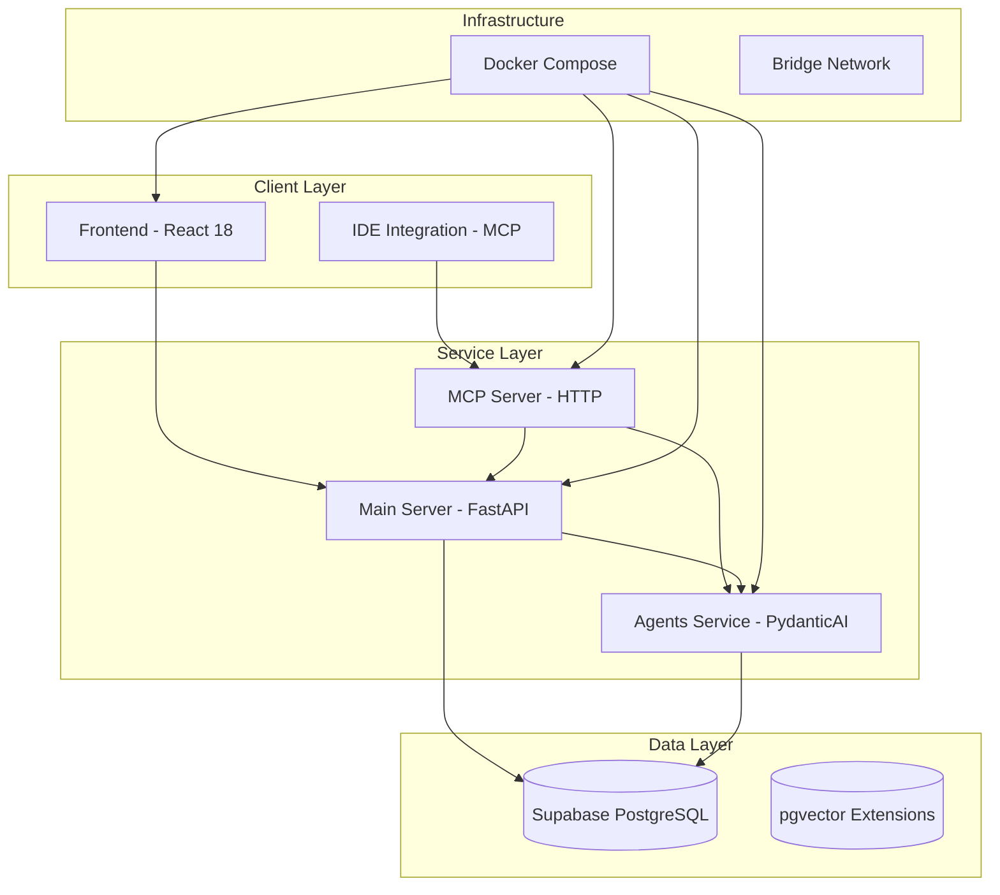

# Archon Technology Stack

## Overview

Archon V2 Alpha is a true microservices-based knowledge management system with HTTP-only service communication and MCP integration. This document provides a comprehensive overview of all technologies, frameworks, and tools used across the entire system.

## System Architecture



## Service Breakdown

### Frontend Service (Port 3737)

**Purpose**: User interface for knowledge management and project operations

**Core Technologies:**
- **React 18.3.1** - Modern React with concurrent features
- **TypeScript 5.5.4** - Type-safe JavaScript with strict configuration
- **Vite 5.2.0** - Lightning-fast build tool and development server
- **TailwindCSS 3.4.17** - Utility-first CSS framework

**UI Enhancement Stack:**
- **Framer Motion 11.5.4** - Smooth animations and transitions
- **React DND 16.0.1** - Drag-and-drop functionality for task management
- **Lucide React 0.441.0** - Beautiful SVG icon library
- **Socket.IO Client 4.8.1** - Real-time WebSocket communication

**Development Tools:**
- **Vitest 1.6.0** - Unit testing framework with coverage reporting
- **ESLint 8.50.0** - Code linting and style enforcement
- **@testing-library/react 14.3.1** - React component testing utilities

**Key Features:**
- Real-time updates via Socket.IO
- Advanced project management with React DND
- Responsive design with TailwindCSS
- Comprehensive test coverage with Vitest

**Build Configuration:**
- Hot module replacement in development
- Optimized production builds with Vite
- Proxy configuration for API communication
- Static asset optimization

### Main Server Service (Port 8181)

**Purpose**: Core API server handling business logic, crawling, and real-time communication

**Core Framework:**
- **FastAPI 0.104.0+** - Modern, high-performance web framework
- **Python 3.12** - Latest Python with enhanced type hints
- **Uvicorn 0.24.0+** - ASGI server with WebSocket support
- **Pydantic 2.0.0+** - Data validation and serialization

**Real-time Communication:**
- **Socket.IO (AsyncIO) 5.11.0+** - WebSocket server for real-time updates
- **Async/Await Patterns** - Non-blocking I/O operations throughout

**Web Crawling Stack:**
- **Crawl4AI 0.6.2** - Advanced web crawling and content extraction
- **BeautifulSoup4** - HTML parsing and content extraction
- **aiohttp** - Async HTTP client for web requests

**Document Processing:**
- **PyPDF2 3.0.1+** - PDF document processing
- **python-docx 1.1.2+** - Microsoft Word document handling
- **pdfplumber 0.11.6+** - Advanced PDF text extraction

**AI/ML Integration:**
- **OpenAI 1.71.0** - GPT integration for embeddings and chat
- **sentence-transformers 4.1.0+** - Local embedding models
- **Logfire 0.30.0+** - AI observability and monitoring

**Security & Authentication:**
- **python-jose[cryptography] 3.3.0+** - JWT token handling
- **cryptography 41.0.0+** - Encryption and security utilities
- **slowapi 0.1.9+** - Rate limiting middleware

### MCP Server Service (Port 8051)

**Purpose**: Model Context Protocol server providing 14+ specialized tools for IDE integration

**Core Framework:**
- **MCP 1.7.1** - Official MCP protocol implementation
- **HTTP Transport** - REST API instead of stdio for better integration
- **FastAPI** - Lightweight HTTP server for tool execution

**Tool Categories:**
- **Knowledge Management**: RAG queries, code example search
- **Project Management**: CRUD operations for projects and tasks
- **Document Management**: Version control, document operations
- **Feature Management**: Project feature tracking and organization

**Key Features:**
- HTTP-based MCP protocol (not stdio)
- Service delegation to appropriate backend services
- Real-time updates via Socket.IO integration
- Comprehensive error handling and timeout management

### Agents Service (Port 8052)

**Purpose**: AI/ML operations, reranking, and multi-provider LLM support

**AI Framework:**
- **PydanticAI 0.0.13** - Modern AI agent framework with type safety
- **OpenAI 1.71.0** - GPT models for various AI operations
- **sentence-transformers** - Local embedding generation

**Core Capabilities:**
- **Agentic RAG** - Advanced retrieval-augmented generation
- **Cross-encoder Reranking** - Improved search result ranking
- **Multi-provider LLM Support** - Support for various AI providers
- **Contextual Embeddings** - Enhanced document understanding

**Performance Features:**
- Async processing for concurrent AI operations
- Caching mechanisms for repeated operations
- Optimized embedding pipelines

## Database Technology

### Supabase PostgreSQL

**Core Database:**
- **PostgreSQL 15+** - Advanced relational database
- **Row Level Security (RLS)** - Multi-tenant security policies
- **Real-time Subscriptions** - Database change notifications

**Vector Search:**
- **pgvector Extension** - High-performance vector similarity search
- **Hybrid Search** - Combining full-text and vector search
- **Contextual Embeddings** - Enhanced embeddings with document context

**Key Tables:**
- `sources` - Crawled websites and uploaded documents
- `documents` - Processed document chunks with embeddings
- `code_examples` - Extracted code snippets with metadata
- `projects` - Project management data
- `tasks` - Task tracking and status management
- `archon_settings` - Runtime configuration with encryption

## Development Tools

### Python Development Stack

**Package Management:**
- **uv** - Modern, fast Python package manager (replaces pip/poetry)
- **pyproject.toml** - Project configuration and dependency management

**Code Quality:**
- **Ruff 0.12.5+** - Lightning-fast Python linter (replaces flake8, isort, black)
- **Mypy 1.17.0+** - Static type checking with strict configuration
- **120 character line length** - Modern code formatting standard

**Testing Framework:**
- **pytest 8.0.0+** - Comprehensive testing framework
- **pytest-asyncio 0.21.0+** - Async test support
- **pytest-cov 6.2.1+** - Code coverage reporting
- **Factory Boy 3.3.0+** - Test data generation

### Frontend Development Stack

**Build Tools:**
- **Vite 5.2.0** - Next-generation build tool with HMR
- **TypeScript 5.5.4** - Strict type checking configuration
- **PostCSS** - CSS processing and optimization

**Code Quality:**
- **ESLint 8.50.0** - JavaScript/TypeScript linting
- **@typescript-eslint** - TypeScript-specific ESLint rules
- **Prettier** - Code formatting (integrated with ESLint)

**Testing:**
- **Vitest 1.6.0** - Vite-native unit testing framework
- **@testing-library/react 14.3.1** - React testing utilities
- **@vitest/coverage-v8 1.6.0** - Code coverage reporting
- **jsdom 24.1.0** - DOM simulation for testing

## Infrastructure & Deployment

### Docker Architecture

**Container Orchestration:**
- **Docker Compose** - Multi-service orchestration
- **Bridge Networking** - Inter-service communication
- **Volume Mounts** - Source code hot reload in development
- **Health Checks** - Service monitoring and restart policies

**Build Strategy:**
- **Multi-stage Builds** - Optimized production images
- **BuildKit Caching** - Faster builds with layer caching
- **Service Isolation** - Independent service scaling and restart

**Development Profiles:**
- Default: All services (full development environment)
- `backend`: Backend services only (hybrid development)
- `full`: Complete Docker deployment

### Service Communication

**HTTP-Only Architecture:**
- **No Shared Dependencies** - Complete service isolation
- **RESTful APIs** - Standardized inter-service communication
- **Environment-based Discovery** - Docker Compose networking
- **Structured Error Responses** - Consistent error handling

**Port Configuration:**
- Frontend: 3737 (VITE_API_URL proxy configuration)
- Main Server: 8181 (FastAPI + Socket.IO)
- MCP Server: 8051 (HTTP-based MCP protocol)
- Agents Service: 8052 (PydanticAI operations)

## Configuration Management

### Environment Variables

**Required Configuration:**
```bash
SUPABASE_URL=https://your-project.supabase.co
SUPABASE_SERVICE_KEY=your-service-key-here
```

**Optional Configuration:**
```bash
OPENAI_API_KEY=your-openai-key        # Can be set via UI
LOGFIRE_TOKEN=your-logfire-token      # For observability
LOG_LEVEL=INFO                         # DEBUG, INFO, WARNING, ERROR
```

### Database-Driven Settings

**Runtime Configuration:**
- **archon_settings table** - Feature toggles and configuration
- **Encrypted Storage** - Secure API key storage
- **Feature Flags** - Projects/tasks feature control
- **Dynamic Updates** - Runtime configuration changes

## Quality Assurance

### Code Quality Standards

**Python Standards:**
- Ruff linting with comprehensive rule set
- Mypy strict type checking
- 120-character line length
- Async/await patterns for I/O operations

**TypeScript Standards:**
- Strict TypeScript configuration
- ESLint with React and accessibility rules
- Comprehensive test coverage requirements
- TailwindCSS utility-first styling

### Testing Strategy

**Backend Testing:**
- Unit tests with pytest
- Integration tests for service communication
- API endpoint testing with TestClient
- Database operation testing with test fixtures

**Frontend Testing:**
- Component testing with React Testing Library
- Unit tests with Vitest
- User interaction testing with user-event
- Coverage reporting and thresholds

### Quality Gates

**Pre-commit Requirements:**
- `uv run ruff check && uv run mypy src/` (Python)
- `npm run lint && npm run test` (Frontend)
- Docker builds include linting and type checking

## Performance Optimization

### Backend Performance

**Async Patterns:**
- Non-blocking I/O throughout the application
- Concurrent request handling with FastAPI
- Background task processing with asyncio
- Connection pooling for database operations

**Caching Strategy:**
- In-memory caching for frequently accessed data
- Database query optimization with proper indexing
- Vector similarity search optimization

### Frontend Performance

**Build Optimization:**
- Tree-shaking with Vite
- Code splitting and lazy loading
- Optimized bundle sizes
- Modern JavaScript output

**Runtime Performance:**
- React 18 concurrent features
- Efficient state management
- Optimized re-rendering with memoization
- Socket.IO event optimization

## Monitoring & Observability

### Logging & Monitoring

**Application Monitoring:**
- **Logfire Integration** - AI-powered observability platform
- **Structured Logging** - JSON-formatted logs with context
- **Error Tracking** - Comprehensive error capture and reporting
- **Performance Metrics** - Request timing and throughput monitoring

**Health Monitoring:**
- Service health checks in Docker Compose
- API endpoint health monitoring
- Database connection monitoring
- Real-time service status reporting

## Security Considerations

### API Security

**Authentication & Authorization:**
- JWT token-based authentication
- Supabase Row Level Security (RLS) policies
- API rate limiting with slowapi
- CORS configuration for secure cross-origin requests

**Data Security:**
- Encrypted storage for sensitive configuration
- Secure API key management
- Input validation with Pydantic models
- SQL injection prevention with parameterized queries

### Infrastructure Security

**Container Security:**
- Non-root user execution in containers
- Minimal base images with security updates
- Network isolation with Docker bridge networks
- Environment variable security best practices

## Technology Version Matrix

| Component | Technology | Version | Purpose |
|-----------|------------|---------|---------|
| **Frontend** | React | 18.3.1 | UI Framework |
| | TypeScript | 5.5.4 | Type Safety |
| | Vite | 5.2.0 | Build Tool |
| | TailwindCSS | 3.4.17 | Styling |
| | Vitest | 1.6.0 | Testing |
| **Backend** | Python | 3.12 | Runtime |
| | FastAPI | 0.104.0+ | Web Framework |
| | Pydantic | 2.0.0+ | Data Validation |
| | Ruff | 0.12.5+ | Linting |
| | uv | Latest | Package Manager |
| **AI/ML** | OpenAI | 1.71.0 | LLM Integration |
| | PydanticAI | 0.0.13 | AI Agents |
| | sentence-transformers | 4.1.0+ | Embeddings |
| **Database** | PostgreSQL | 15+ | Primary Database |
| | pgvector | Latest | Vector Search |
| | Supabase | Latest | Database Platform |
| **Infrastructure** | Docker | Latest | Containerization |
| | Docker Compose | Latest | Orchestration |

## Development Workflow

### Local Development Setup

1. **Environment Setup:**
   ```bash
   # Clone repository and setup environment
   cp .env.example .env
   # Configure SUPABASE_URL and SUPABASE_SERVICE_KEY
   ```

2. **Docker Development:**
   ```bash
   docker-compose up --build -d
   # All services available at their respective ports
   ```

3. **Hybrid Development:**
   ```bash
   # Backend in Docker, frontend locally
   docker-compose --profile backend up -d
   cd archon-ui-main && npm run dev
   ```

### Quality Assurance Workflow

1. **Pre-development:**
   - Check Archon MCP server availability
   - Review current tasks and priorities
   - Conduct research-driven development

2. **Development Process:**
   - Follow strict typing and linting rules
   - Write tests for new functionality
   - Maintain comprehensive documentation

3. **Pre-commit Validation:**
   - Run code quality checks
   - Ensure test coverage requirements
   - Validate Docker builds

This technology stack provides a robust, scalable foundation for the Archon knowledge management system, emphasizing type safety, performance, and developer experience while maintaining strict quality standards throughout the development process.